# Paper Identification

|           |                      |
|-----------|----------------------|
| ID        |  |
| Author    |    |
| Title     |     |
| Iteration |     |

Some useful information up front:

-   [JPE Data and Code Availability Policy](https://www.journals.uchicago.edu/journals/jpe/datapolicy)
-   [Step by step guidance from Data Editor for Authors](https://jpedataeditor.github.io/)
-   [Template README](https://social-science-data-editors.github.io/template_README/)
-   

# Summary

In assessing compliance with our [Data and Code Availability Policy](https://www.journals.uchicago.edu/journals/jpe/datapolicy), our reproducibility team has identified the following issues, which we ask you to address:

1.  Data Editor's first point.
2.  Data Editor's second point.

# General

-   [x] Data Availability and Provenance Statements
    -   [x] Statement about Rights - Part 1: Right to use the data (e.g. *did the authors lawfully obtain the data*)
    -   [ ] Statement about Rights - Part 2: Right to publish the data (e.g. *are human subjects involved and did permission been granted to publish their data?*)
    -   [ ] License for Data (optional, but recommended)
    -   [ ] Details on each Data Source
-   [x] Dataset list
-   [x] Computational requirements
    -   [x] Software Requirements
    -   [ ] Controlled Randomness (as necessary)
    -   [x] Memory, Runtime, and Storage Requirements
-   [x] Description of programs/code
    -   [x] License for Code (Optional, but recommended)
-   [ ] {REPLICATOR} to Replicators
    -   [x] Details (as necessary)
-   [x] List of tables and programs
-   [x] References (Optional, but recommended)

Note that the authors provide 2 distinct ReadMe's. Not sure whether it would be more suitable to combine them into one.

# High-level Description of Research Project

*This research project...*

-   [ ] uses observational data.
-   [x] uses *confidential* observational data.
-   [ ] uses data generated via experiment or trial by the authors (in field or lab).
    -   [ ] For lab experiments: The code to implement the experimental protocol (z-Tree, o-Tree etc) is included in the package.
    -   [ ] A PDF copy of IRB approval is contained in the package.
    -   [ ] A PDF document outlining the design of the experiment, including information on the selection and eligibility of participants is included.
    -   [ ] A PDF copy of the instructions given to participants in both original language and an English translation is included.
-   [ ] uses data generated via survey by the authors (in field or online)
    -   [ ] The programs used to administer the survey (e.g. qualtrics survey file) are included.
    -   [ ] A PDF copy of IRB approval is contained in the package.
    -   [ ] A PDF of the original questionaire(s) and information on the selection and eligibility of participants is included.
-   [x] is a simulation study: the data are generated by an algorithm.
-   [ ] is a numerical illustration: no data are used but code is used to produce illustrative output (tables, figures)

# Data description

For any data that cannot be provided as part of the replication package, please provide the following information as part of the README.

> {REQUIRED} Please specify how long the data will be preserved in the restricted-access location.

> {REQUIRED} Please provide affirmation of support for replication checks. - As per the [JPE policy](https://jpedataeditor.github.io/policy.html), "In cases where data cannot be published in an openly accessible trusted data repository like the JPE dataverse, authors who have requested an exemption to publish them at the time of first submission must commit to preserving the data and code for a period of no less than five years following the publication of the paper. They should also provide reasonable assistance to requests for clarification and replication."

> {REQUIRED} Please provide a codebook for the data. - The codebook should at a minimum describe the variables obtained from the data source, in a manner that will let others verify that they have obtained a substantially similar dataset if successfully obtaining access to the data.

## Data Sources

| file/name | public | private | shared with us | DOI/URL | Access described | cited readme | cited paper |
|---------|---------|---------|---------|---------|---------|---------|---------|
| BTS-Postes / DADS Postes 1995-2008 | no | no | no | yes | yes / CASD procedure | no | yes |
| BTS-Entreprises / DADS Entreprises | no | no | no | yes | yes / CASD procedure | no | yes |
| FICUS / SUSE 1996-2007 | no | no | no | yes | yes / CASD procedure | no | yes |
| FARE / ESANE 2010-2016 | no | no | no | yes | yes / CASD procedure | no | no |
| Déclarations 2483 2002-2007 | no | no | no | yes | yes / CASD procedure | no | yes |
| Allègement des cotisations sociales | no | no | no | yes | yes / CASD procedure | no | yes |
| BIC-RN | no | no | no | yes | yes / CASD procedure | no | yes |
| Baker, Bloom and Davis (2016) | yes | no | yes | yes | \- | yes | no |
| Bozio and Wasmer (2024) | yes | no | yes | yes | \- | yes | yes |

### Public Data

The CASD ReadMe mentions input data sources that are public data and not part of the CASD but they are not detailed in the ReadMe.

-   [x] Dataset is provided in public deposit
-   [ ] Dataset is PRIVATELY provided (not for publication)
-   [ ] DOI or URL is provided, and works: http://data.bls.gov/cgi-bin/surveymost?sm+08
-   [ ] Access conditions are described:
    -   No information on access conditions.
-   [ ] Data are not cited, but a working paper, article, or other document is cited (not a data citation)
-   [ ] Data are cited
    -   [ ] in the manuscript
    -   [ ] in the README:

### Allègement des cotisations sociales

Data citation in paper mentions INSEE as author, the ReadMe says DARES.

### FARE-ESANE

Data citation not found in neither the manuscript nor the ReadMe.

### Baker, Bloom and Davis (2016)

Not cited in the manuscript.

# Requirements

> {REPLICATOR}: Check that these requirements are met.

-   [x] README is in TXT, MD, or PDF format

-   [ ] README is accessible at the root of the package (not inside a folder)

-   [ ] Title conforms to guidance (starts with "Data and Code for: Title of Paper" or "Code for: Title of Paper", is properly capitalized)

-   [ ] Authors (with affiliations) are listed in the same order as on the paper

> {REQUIRED} Please ensure that a ASCII (txt), Markdown (md), or PDF version of the README are available in the data and code deposit.

> {REQUIRED} Please review the title of the deposit as per our guidelines.

> {REQUIRED} Please review authors and affiliations on the deposit. In general, they are the same, and in the same order, as for the manuscript; however, authors can deviate from that order.

No affiliation for Nicholas Lawson in CASD_ReadMe mentioned.

## Stated Requirements

-   [ ] No requirements specified
-   [x] Software Requirements specified as follows:
    -   SAS version 9.04.01M7P08052020, for WINDOWS (X64_SRV19), 4CPU
    -   STATA 17, for Windows (PC 64-bit x86-64), MP 4 processors, born date: 18 Jul 2023
    -   esttab / estpost / estout versions 2.1.1 / 1.2.2 / 3.31
    -   tabout version 2.0.8
    -   reghdfe version 6.12.3
    -   ivreghdfe version 1.1.3
    -   ivreg2 version 4.1.11
    -   ranktest version 2.0.04
    -   ftools version 2.49.1
    -   Matlab (last run with Matlab release R2024b)
    -   R (code was last run with R version 4.6.1)
    -   Global Optimization Toolbox (for Matlab)
-   [x] Computational Requirements specified as follows:
    -   under 25MBytes needed.
-   [x] Time Requirements specified as follows:
    -   Length of necessary computation: ca. 3h (CASD)
    -   36h (R and Matlab part)
-   [ ] Requirements are complete.

# Analyzing Data and Code Files











## Code description

The replication package is split in 2 distinct parts:

The first part contains all the code to replicate the results based on non-public data the authors could not share with us, with a separate ReadMe document. This part contains 1) code/manual/ — author-tested execution path (27 sas-files and 6 do-files); code/Programs/ — SAS/Stata scientific programs needed by the retained manual path (4 SAS programs and 3 Stata); code/Tools/ — only the three helpers needed by the retained path: SAS environment check, Stata environment check, and CASD path resolver. This part contains also 2 files (1 for stata and 1 for sas) that call the stages of the replication in the right order.

The second part contains the code that may replicate results based on simulations and publicly available data. This part contains 4 matlab folders for the simulation exercise and 2 R folders that will create figures and tables. No master script was found in this folder.

The CASD part of the replication does not detail line numbers where results are replicated. No in-text numbers were reported in the ReadMe's. It would be great if the authors could include a table indicating which results of the article are reproduced by what part of the replication package the public one or the non-public one.



-   [ ] The replication package contains a "main" or "master" file(s) which calls all other auxiliary programs.

> {SUGGESTED} We strongly advise the use of a single (or a small number of) main control file(s) to automatically reproduce all figures and tables in the paper, without manual interaction.

> NOTE: In-text numbers that reference numbers in tables do not need to be listed. Only in-text numbers that correspond to no table or figure need to be listed.

## Computing Environment of the Replicator

-   Nuvolos, 4CU.
-   R 4.5.2 with quarto
-   Matlab R2024b

# Replication

-   Downloaded code and data from dropbox.
-   Committed code to git repo.
-   I did not try to run the codes of the CASD folder as I do not have CASD access, I concentrated on the MatlabR folder. I changed all the main file paths in the 10 main.m scripts to fit to the nuvolos environment.
-   To test how long one iteration of the simulation would take I ran the baseline specification first by itself which completed in ca. 54h.

# Findings {#sec-findings}

## Data Preparation Code
-  Figure6.csv, Figure7.csv, Figure8.csv, FigureF1.csv, FigureF2.csv, FigureF2_96.csv, FigureF2_64.csv were reproduced.

## Tables and Figures

-   Figure 3A: the reproduced figure looks slightly different from the figure in the manuscripts: 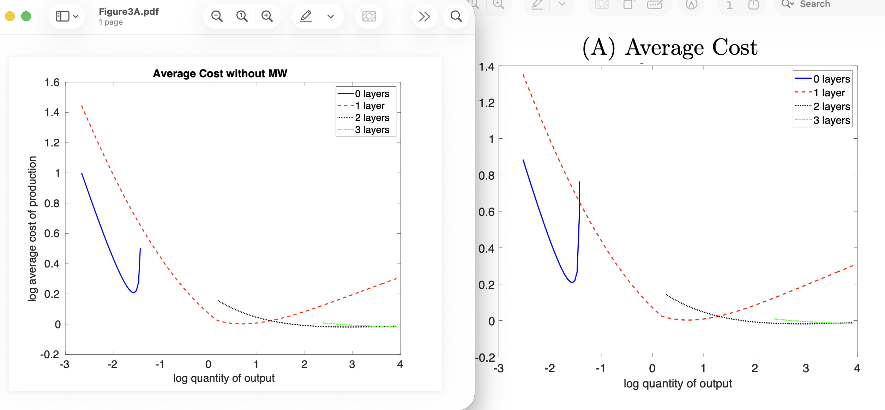
-   Figure 3B: the reproduced figure looks slightly different from the figure in the manuscripts: 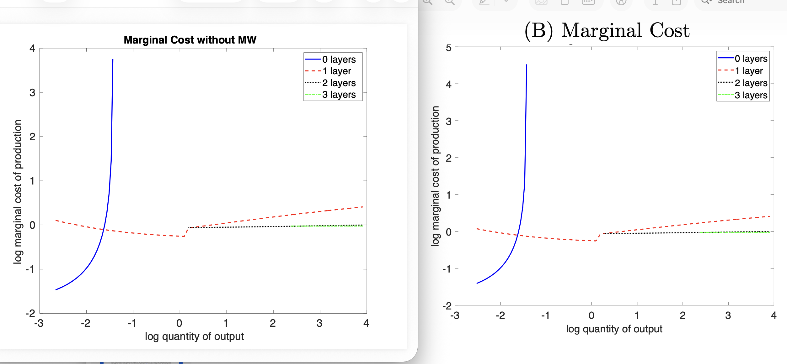
-   Figure 4A: the reproduced figure looks slightly different from the figure in the manuscripts: 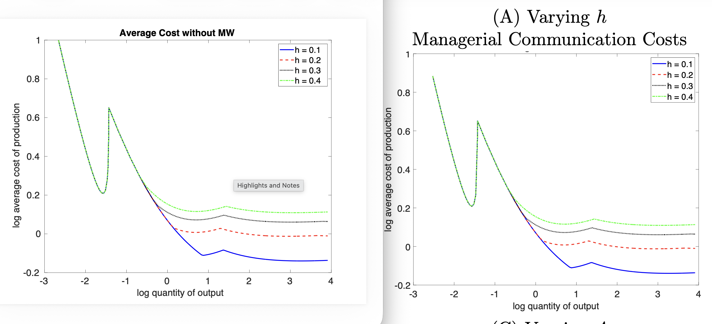
-   Figure 4B: the reproduced figure looks slightly different from the manuscript: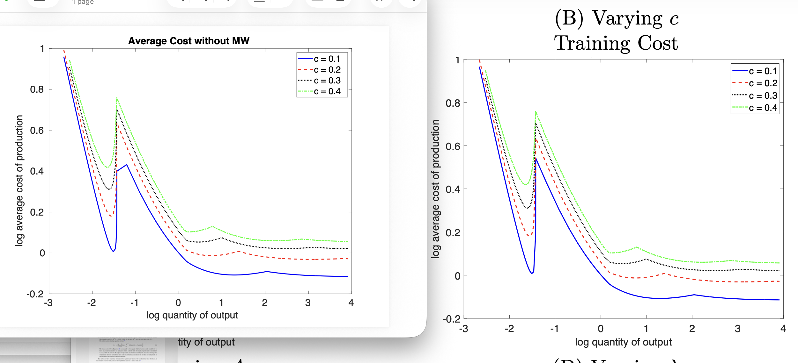
-   Figure 4C: the reproduced figure looks slightly different from the manuscript: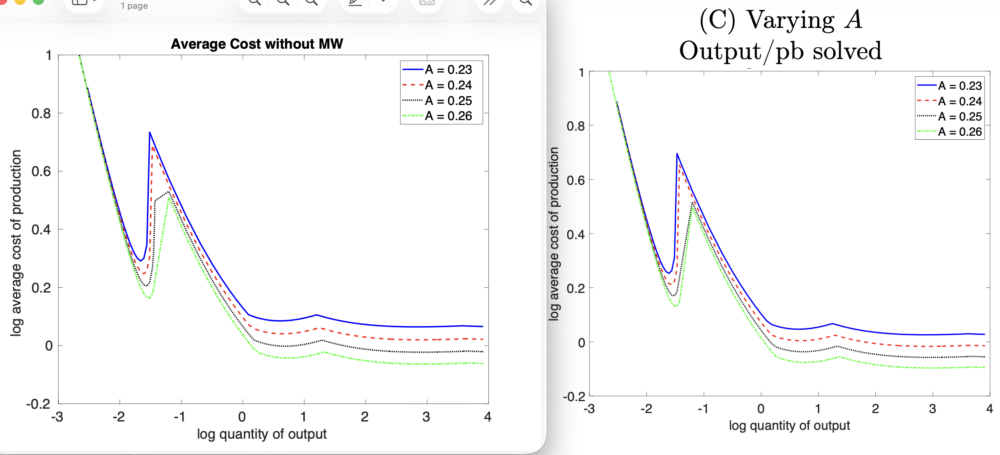
-   Figure 4D: the reproduced figure looks slightly different from the manuscript: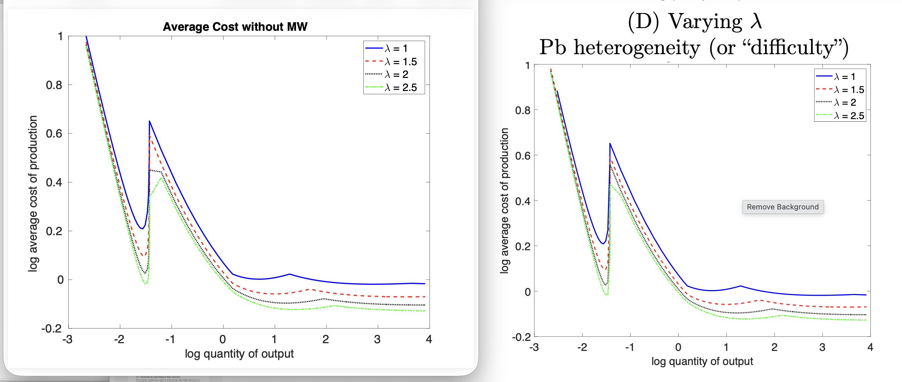
-   Figure 5A: the reproduced figure looks slightly different from the manuscript: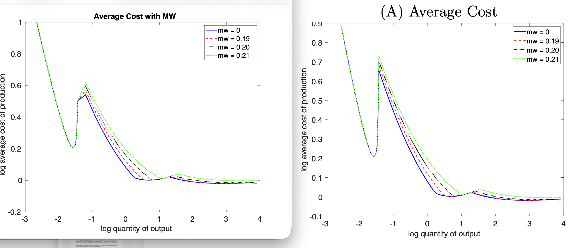
-   Figure 5B: the reproduced figure looks slightly different from the manuscript: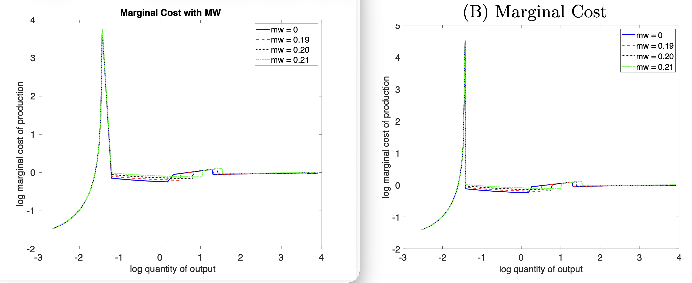

- Figure F1 fully reproduced. 

- Table F1 values are slightly different.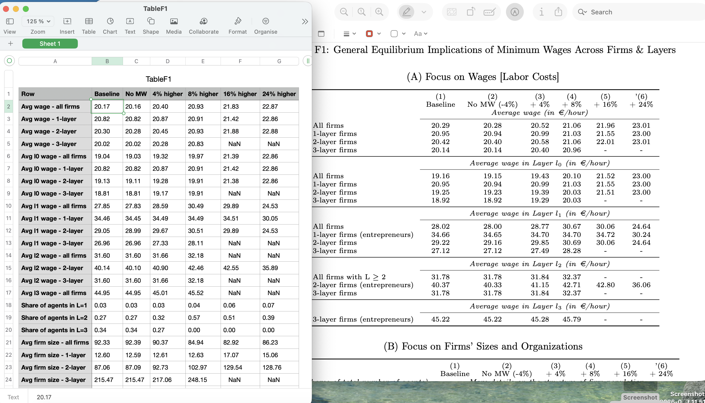 

- Table F2 values are slightly different.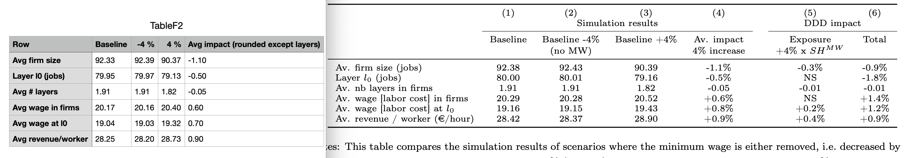 

- Table 5: values are slightly different. 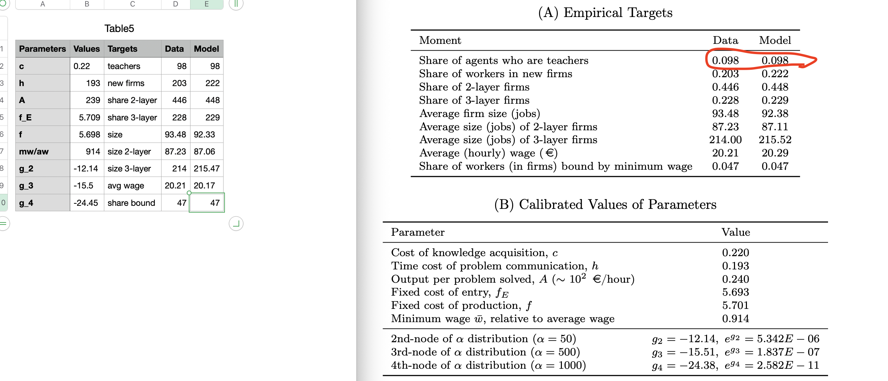 

- Table 6: values are slightly different. 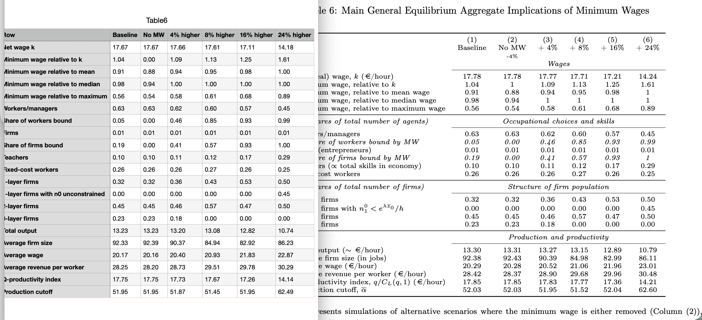 

## In-Text Numbers

-   I did not identify any in-text numbers. 

## Other Issues

-   n.a. 

# Classification

-   [ ] full reproduction
-   [ ] full reproduction with minor issues
-   [x] partial reproduction (see above)
-   [ ] not able to reproduce most or all of the results (reasons see above)

## Reason for incomplete reproducibility

-   [ ] None.
-   [x] `Discrepancy in output` (either figures or numbers in tables or text differ)
-   [ ] `Bugs in code` that were fixable by the replicator (but should be fixed in the final deposit)
-   [ ] `Code missing`, in particular if it prevented the replicator from completing the reproducibility check
    -   [ ] `Data preparation code missing` should be checked if the code missing seems to be data preparation code
-   [ ] `Code not functional` is more severe than a simple bug: it prevented the replicator from completing the reproducibility check
-   [ ] `Software not available to replicator` may happen for a variety of reasons, but in particular (a) when the software is commercial, and the replicator does not have access to a licensed copy, or (b) the software is open-source, but a specific version required to conduct the reproducibility check is not available.
-   [x] `Insufficient time available to replicator` is applicable when (a) running the code would take weeks or more (b) running the code might take less time if sufficient compute resources were to be brought to bear, but no such resources can be accessed in a timely fashion (c) the replication package is very complex, and following all (manual and scripted) steps would take too long.
-   [ ] `Data missing` is marked when data *should* be available, but was erroneously not provided, or is not accessible via the procedures described in the replication package
-   [x] `Data not available` is marked when data requires additional access steps, for instance purchase or application procedure.
-   [ ] `Missing README` is marked if there is no README to guide the replicator, or the README is not in compliance with JPE requirements



